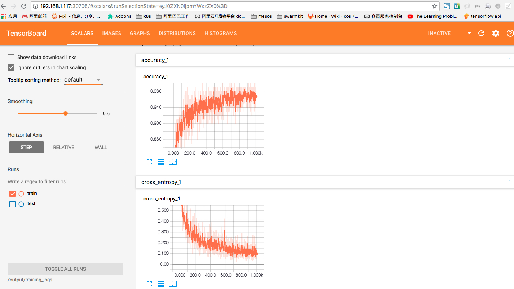


这个示例展示了如何使用 `Arena` 进行机器学习训练。它会从 git url 下载源代码，并使用 Tensorboard 可视化 Tensorflow 计算图形、绘制量化指标。

1. 第一步是检查可用资源

```
arena top node
NAME IPADDRESS ROLE GPU(Total) GPU(Allocated)
i-j6c68vrtpvj708d9x6j0 192.168.1.116 master 0 0
i-j6c8ef8d9sqhsy950x7x 192.168.1.119 worker 1 0
i-j6c8ef8d9sqhsy950x7y 192.168.1.120 worker 1 0
i-j6c8ef8d9sqhsy950x7z 192.168.1.118 worker 1 0
i-j6ccue91mx9n2qav7qsm 192.168.1.115 master 0 0
i-j6ce09gzdig6cfcy1lwr 192.168.1.117 master 0 0
-----------------------------------------------------------------------------------------
Allocated/Total GPUs In Cluster:
0/3 (0%)
```

有 3 个带有 GPU 的可用节点用于运行训练作业。


2\.现在，我们可以通过 `arena cli` 提交一个训练作业，这会从 github 下载源代码

```
#arena submit tf \
             --name=tf-tensorboard \
             --gpus=1 \
             --image=tensorflow/tensorflow:1.5.0-devel-gpu \
             --syncMode=git \
             --syncSource=https://github.com/cheyang/tensorflow-sample-code.git \
             --tensorboard \
             --logdir=/tmp/tensorflow/logs \
             "python code/tensorflow-sample-code/tfjob/docker/mnist/main.py --max_steps 5000"
NAME:   tf-tensorboard
LAST DEPLOYED: Mon Jul 23 18:30:50 2018
NAMESPACE: default
STATUS: DEPLOYED

RESOURCES:
==> v1/Service
NAME TYPE CLUSTER-IP EXTERNAL-IP PORT(S) AGE
tf-tensorboard-tfjob NodePort 172.19.15.183  6006:30705/TCP 0s

==> v1beta1/Deployment
NAME DESIRED CURRENT UP-TO-DATE AVAILABLE AGE
tf-tensorboard-tfjob 1 0 0 0 0s

==> v1alpha2/TFJob
NAME AGE
tf-tensorboard-tfjob 0s

==> v1/Pod(related)
NAME READY STATUS RESTARTS AGE
tf-tensorboard-tfjob-64455d5b69-jmm6s 0/1 Pending 0 0s
```

> 这会下载源代码，并将其解压缩到工作目录的 `code/` 目录。默认的工作目录是 `/root`，您也可以使用 `--workingDir` 加以指定。

> `logdir` 指示 Tensorboard 在何处读取 TensorFlow 的事件日志

3\.列出所有作业

```
#arena list
NAME STATUS TRAINER AGE NODE
tf-tensorboard RUNNING TFJOB 0s 192.168.1.119
```

4\.检查作业所使用的资源

```
#arena top job
NAME STATUS TRAINER AGE NODE GPU(Requests) GPU(Allocated)
tf-tensorboard RUNNING TFJOB 26s 192.168.1.119 1 1


Total Allocated GPUs of Training Job:
0

Total Requested GPUs of Training Job:
1
```


5\.检查集群所使用的资源


```
#arena top node
NAME IPADDRESS ROLE GPU(Total) GPU(Allocated)
i-j6c68vrtpvj708d9x6j0 192.168.1.116 master 0 0
i-j6c8ef8d9sqhsy950x7x 192.168.1.119 worker 1 1
i-j6c8ef8d9sqhsy950x7y 192.168.1.120 worker 1 0
i-j6c8ef8d9sqhsy950x7z 192.168.1.118 worker 1 0
i-j6ccue91mx9n2qav7qsm 192.168.1.115 master 0 0
i-j6ce09gzdig6cfcy1lwr 192.168.1.117 master 0 0
-----------------------------------------------------------------------------------------
Allocated/Total GPUs In Cluster:
1/3 (33%)
```


6\.获取特定作业的详细信息

```
#arena get tf-tensorboard
NAME STATUS TRAINER AGE INSTANCE NODE
tf-tensorboard RUNNING tfjob 15s tf-tensorboard-tfjob-586fcf4d6f-vtlxv 192.168.1.119
tf-tensorboard RUNNING tfjob 15s tf-tensorboard-tfjob-worker-0 192.168.1.119

Your tensorboard will be available on:
192.168.1.117:30670
```

> 注意：您可以使用 `192.168.1.117:30670` 访问 Tensorboard。如果您通过笔记本电脑无法直接访问 Tensorboard，则可以考虑使用 `sshuttle`。例如：`sshuttle -r root@47.89.59.51 192.168.0.0/16`




恭喜！您已经使用 `arena` 成功运行了训练作业，而且还能轻松检查 Tensorboard。
